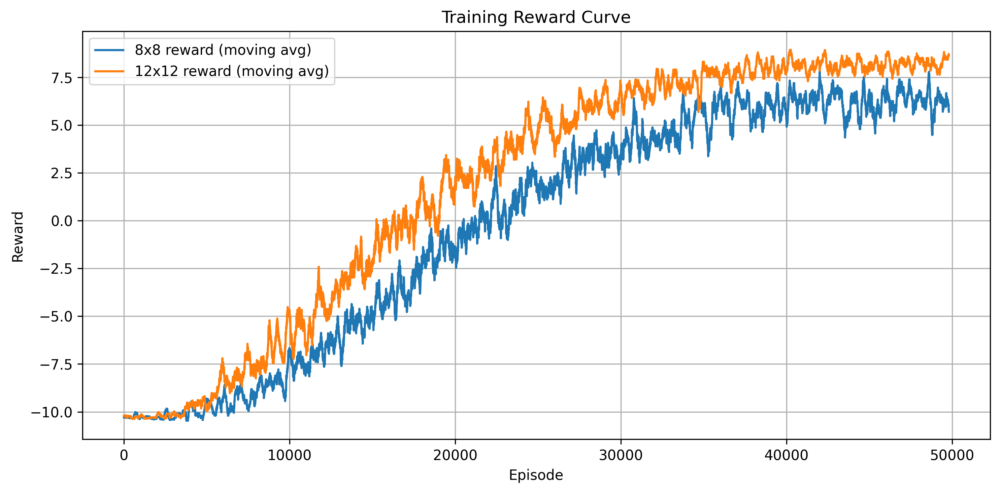
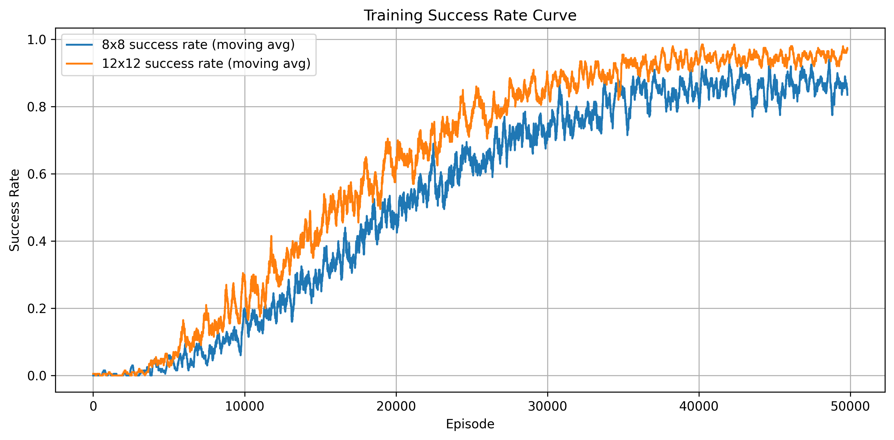
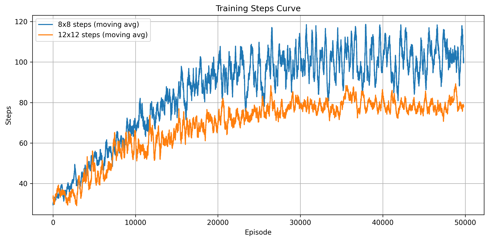

# 基于随机滑动 FrozenLake 的 Q-learning 求解实验

### 实验目的

1. 理解 Gymnasium 中 FrozenLake 环境的状态、动作、奖励与终⽌机制。
2. 掌握表格型 Q-learning 的基本实现⽅法。
3. 观察在随机滑动条件下，探索机制对学习效果的影响。
4. 比较在 8x8 预设地图与⾃定义12x12 地图上，Q-learning 的训练难度与最终表现差异。

### 实验要求

1. 实现 Q-learning。
2. 必须启用随机滑动。
3. 比较两种地图上的学习效果。
4. 输出最终策略。
5. 可视化结果。

### 设计思路

##### 1.实验环境构建与任务建模

本实验采用 Gymnasium 作为实验平台，并选取其中的 FrozenLake-v1 环境进行研究。基于该环境，分别采用了官方 8×8 地图和自定义的 12×12 地图，并统一设置 `is_slippery=True`，这使智能体动作具有随机滑动特性，从而增加任务难度。

对于具体任务，智能体需要从起点出发，在避开冰洞的前提下尽可能到达终点。环境中的 `S` 表示起点，`F` 表示安全区域，`H` 表示冰洞，`G` 表示终点。状态表示智能体当前所在的位置，动作空间包括左、下、右、上四个离散动作，环境根据智能体执行动作后的结果返回相应奖励，并在到达终点、掉入冰洞或超过最大步数时结束当前回合。

##### 2.动作选择策略设计

本实验采用 epsilon-greedy 的动作选择策略，也就是以概率 `epsilon` 随机选择动作，以概率 `1-epsilon` 选择当前状态下 Q 值最大的动作，同时使 `epsilon` 随着回合数的增大逐渐衰减。这保证了agent在训练初期保持一定探索能力，在训练后期则可以逐渐利用已学习到的经验。具体而言，实验开始时先将 `epsilon` 设为 1.0，使智能体能够充分探索环境。随后随着训练的进行，按照设定的衰减系数逐渐减小 `epsilon`，并设置最小探索率下限为 0.02，避免后期探索能力完全消失。每回合的探索率衰减系数设置为 0.999，并每隔一定回合更新一次。

##### 3.奖励设计与训练优化

FrozenLake 环境本身的奖励较为稀疏，只有智能体成功到达终点时才会获得奖励，其他情况下奖励通常为 0。在 8×8 和 12×12 地图中，由于地图规模较大，并且 `is_slippery=True` 会导致动作结果具有随机性，如果只使用原始奖励，智能体在训练初期很难获得有效反馈，学习速度会比较慢。因此，本实验在训练过程中对奖励进行了适当重塑。

具体而言，当智能体成功到达终点时，将奖励设置为较大的正值 `10`，用于鼓励智能体学习通向终点的路径。当回合结束但没有获得原始奖励时，将奖励设置为 `-10`，用于惩罚掉入冰洞或未能成功完成任务的情况。在普通移动过程中，则给予 `-0.01` 的小惩罚，减少智能体在安全区域内无意义徘徊的倾向。这样的奖励设计能够让智能体更清楚地区分成功、失败和普通移动三种情况，从而提高训练效率。

同时，为了保证实验评估结果仍然符合 FrozenLake 原始环境定义，代码在判断是否成功时仍然使用环境返回的原始 `reward`，即只有 `reward > 0` 时才认为智能体成功到达终点。训练曲线中的回报主要反映奖励重塑后的学习过程，而最终测试阶段的平均回报、成功率和平均步数则用于评价最终贪婪策略的实际表现。此外，实验中设置较大的训练回合数，8×8 和 12×12 地图均训练 50000 回合，并设置最大步数限制为 1000，使智能体在随机滑动环境下有足够机会进行探索和更新。

##### 4.表格型 Q-learning 的实现思路

由于 FrozenLake 的状态空间和动作空间都是离散的，因此本实验采用表格型 Q-learning 方法进行求解。代码中首先根据环境的状态数量和动作数量初始化 Q 表，即 `Q = np.zeros((n_states, n_actions))`。对于官方 8×8 地图，状态数为 64，动作数为 4。对于自定义 12×12 地图，状态数为 144，动作数同样为 4。Q 表中每一行对应一个状态，每一列对应一个动作，表中的数值表示在该状态下执行对应动作的价值估计。

在每一个训练回合中，智能体首先通过 `env.reset()` 回到初始状态，然后根据 epsilon-greedy 策略选择动作，并通过 `env.step(action)` 与环境交互，获得下一状态、奖励以及当前回合是否结束的信息。随后根据 Q-learning 的核心更新公式对 Q 表进行更新。

核心更新公式为：

$$
Q(s,a) \leftarrow Q(s,a) + \alpha \left[ r + \gamma \max_{a'} Q(s',a') - Q(s,a) \right]
$$

其中，$Q(s,a)$ 表示当前状态动作价值，$\alpha$ 表示学习率，$r$ 表示当前奖励，$\gamma$ 表示折扣因子，$s'$ 表示下一状态，$\max_{a'} Q(s',a')$ 表示下一状态下所有可选动作中的最大 Q 值。代码中先计算下一状态的最大 Q 值 `best_next_q = np.max(Q[next_state])`，再构造目标值。如果当前回合已经结束，则目标值只等于当前奖励；如果回合尚未结束，则目标值为当前奖励加上折扣后的未来最大价值，即 `shaped_reward + gamma * best_next_q`。最后根据时序差分误差更新当前状态动作对的 Q 值。

训练完成后，代码通过 `np.argmax(Q[state])` 从每个状态的 Q 值中选择价值最大的动作，得到最终的贪婪策略，并用箭头形式输出策略网格，其中冰洞和终点位置保留原始标记。为了进一步检验学习效果，代码还使用不含探索的贪婪策略进行多次测试，统计平均回报、成功率和平均步数，并将训练曲线和最终测试过程保存到 `run` 文件夹中，便于后续实验报告分析。

##### 5.训练结果评估思路

训练完成后，本实验不再使用带随机探索的 epsilon-greedy 策略，而是采用纯贪婪策略进行测试，即在每一个状态下都选择当前 Q 表中价值最大的动作。这样可以更直接地反映训练后 Q 表所学习到的最终策略质量，避免测试阶段的随机探索影响评价结果。

在评估过程中，分别对 8×8 地图和 12×12 地图进行多回合测试，并统计平均回报、成功率和平均步数三个指标。其中，平均回报使用 FrozenLake 环境返回的原始奖励计算，成功到达终点时奖励为 1，否则为 0。成功率用于衡量智能体最终到达终点的稳定性，平均步数用于衡量智能体完成任务所需的行动效率。

##### 6.两种地图的对比分析思路

本实验的对比对象为 Gymnasium 官方 8×8 地图和自定义 12×12 地图。对比时不仅关注地图规模的变化，还需要结合冰洞分布、可行路径数量以及随机滑动带来的不确定性进行分析。一般情况下，地图越大，状态数量越多，Q 表规模越大，智能体需要探索的状态动作组合也越多，因此训练难度会随地图规模增加而提高。

但是，在 FrozenLake 环境中，训练难度并不只由地图尺寸决定。官方 8×8 地图虽然状态数较少，但冰洞分布较密集，部分路径较窄，在 `is_slippery=True` 的情况下，智能体即使选择了正确方向，也可能因为滑动而偏离路线并掉入冰洞。自定义 12×12 地图虽然状态数更多，但安全区域较宽，可行路径相对更多，因此在足够训练回合下，智能体反而可能获得更稳定的最终策略。

因此，本实验在分析结果时主要从三个方面进行比较：第一，比较最终评估中的成功率，判断策略是否稳定到达终点。第二，比较平均步数，观察策略是否较为高效。第三，结合训练曲线观察两个环境在训练初期和后期的学习变化，从而分析地图结构和随机滑动对 Q-learning 训练效果的影响。

### 实验结果与分析

本次实验结果包括最终 Q 表、训练历史记录、最终策略、训练曲线以及最终测试过程文件。

最终贪婪策略测试结果如下：

| 地图 | 平均回报 | 成功率 | 平均步数 |
| --- | ---: | ---: | ---: |
| FrozenLake 8×8 | 0.908 | 0.908 | 92.786 |
| FrozenLake 12×12 | 1.000 | 1.000 | 81.131 |

从最终测试结果可以看出，8×8 地图的成功率为 90.8%，说明训练后的智能体已经能够较稳定地到达终点，但在随机滑动影响下仍然存在一定失败概率。12×12 地图的最终测试成功率达到 100%，平均步数为 81.131，说明在本次训练结果中，自定义 12×12 地图虽然状态数量更多，但最终策略表现更加稳定，完成任务所需步数也更少。

训练过程末段统计结果如下：

| 地图 | 统计区间 | 平均重塑回报 | 成功率 | 平均步数 |
| --- | --- | ---: | ---: | ---: |
| 8×8 | 前 1000 回合 | -10.2599 | 0.003 | 32.99 |
| 8×8 | 后 1000 回合 | 6.2392 | 0.863 | 103.08 |
| 8×8 | 后 100 回合 | 5.4209 | 0.820 | 98.91 |
| 12×12 | 前 1000 回合 | -10.2757 | 0.003 | 34.57 |
| 12×12 | 后 1000 回合 | 8.2398 | 0.951 | 79.02 |
| 12×12 | 后 100 回合 | 8.4223 | 0.960 | 78.77 |

从训练历史可以看出，在训练前 1000 回合中，两种地图的成功率都只有 0.003，说明训练初期智能体主要处于随机探索阶段，几乎无法稳定找到终点。随着训练回合数增加，Q 表不断更新，智能体逐渐学习到更优的动作选择方式。到训练后 1000 回合时，8×8 地图成功率提升到 0.863，12×12 地图成功率提升到 0.951，说明两种环境都完成了有效学习。

另外，奖励曲线和成功率曲线整体呈上升趋势，说明智能体在训练过程中逐渐积累了有效经验。步数曲线在后期趋于相对稳定，说明策略逐渐收敛，不再完全依赖随机探索。

训练奖励曲线如下：



训练成功率曲线如下：



训练步数曲线如下：



最终 8×8 贪婪策略如下：

```text
→ → → → → → → ↓
↑ ↑ ↑ ↑ ↑ ↑ → →
↑ ← ← H → ↑ → ↓
← ← ← ↑ ← H → →
← ↑ ← H → ↓ ↑ →
← H H ↓ ↑ ← H →
← H ↓ ↑ H ← H →
← ↓ ↓ H ↓ → ↓ G
```

最终 12×12 贪婪策略如下：

```text
→ ↓ → ↑ → → → → → → ↓ →
↓ → ← H → → → → → ↓ → ↓
↓ ↓ → ↓ ↑ → → ↓ → ↓ ↓ ↓
↓ ↓ → ← H → ↓ ↓ ↑ → ↓ ↓
↓ ↓ → → ↓ → ↓ ← H → ↓ ↓
↓ ↑ ↑ → → → → ↓ ↓ ↓ ↓ ↓
← H H → → → → → ↓ ↓ ↓ ↓
↓ ↓ ↓ → → ↑ → → → ↓ ↓ ↓
→ → → → ← H → → → ↓ ↓ ←
← ← → → → ↓ → ↑ → ↓ ↓ ↓
↓ → → → → → ← H → → ↓ ←
↑ → ↑ → → → → ↓ → → → G
```

从策略网格可以看出，训练后的 Q 表已经能够在大多数安全状态中给出明确的行动方向。由于环境开启了随机滑动，箭头并不一定表示一条完全确定的最短路径，而是表示在随机转移条件下，当前 Q 表认为长期收益较高的动作选择。

### 问题与思考

本实验中最明显的问题是 FrozenLake 的原始奖励较为稀疏。如果完全依赖原始奖励，智能体只有在偶然到达终点后才能获得正反馈，在较大地图和随机滑动条件下学习效率较低。因此代码中使用了奖励重塑方法，通过到达终点奖励、失败惩罚和普通移动小惩罚，使智能体能够更快地区分不同状态动作的优劣。

另一个需要注意的问题是随机滑动会使动作结果变得不确定。智能体选择向右移动时，实际结果可能并不是向右，因此最终策略不能简单理解为一条固定路径，而应理解为在随机转移概率下具有较高期望收益的策略。这也是 8×8 地图成功率没有达到 100% 的主要原因之一。

从结果上看，12×12 地图的最终表现优于 8×8 地图，这并不说明大地图一定更容易，而是与本次自定义地图的结构有关。自定义 12×12 地图虽然状态数量更多，但冰洞相对更少，安全区域更宽，在随机滑动条件下容错性更高；官方 8×8 地图冰洞密度更高，部分区域较窄，因此更容易因为滑动导致失败。

### 实验总结

通过本次实验，完成了随机滑动 FrozenLake 环境下的表格型 Q-learning 求解过程。实验实现了环境构建、epsilon-greedy 动作选择、奖励重塑、Q 表更新、最终策略输出、训练曲线绘制和结果保存等功能。最终结果表明，Q-learning 能够在离散状态和离散动作空间中有效学习策略，并且在足够训练回合下可以在 8×8 和 12×12 两种地图上取得较好的表现。

同时，本实验也说明，在随机滑动环境中，学习效果不仅受地图规模影响，还与冰洞分布、路径宽度和探索策略密切相关。合理的奖励设计和足够的训练回合能够明显改善智能体的学习效果，但最终策略仍然会受到环境随机性的影响。
